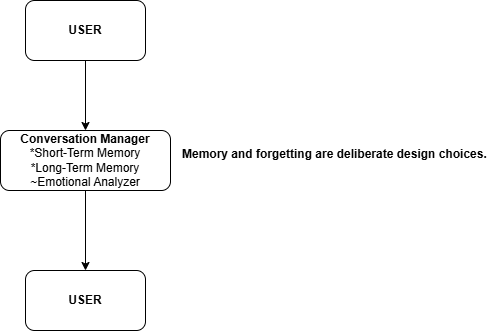

# Memory & Human-Centered Conversational AI Agent

## Overview
This project explores the design of a conversational AI system that emphasizes human-centered interaction over pure task completion. The system focuses on explicit memory and forgetting mechanisms, emotional awareness, and contextual continuity to support users while preserving human judgment.

## System Design
At the core of the system is a Conversation Manager responsible for coordinating memory usage, emotional assessment, and response generation. Memory is treated as a deliberate design choice, with clear distinctions between short-term context and long-term user information.

## Memory
- Short-term memory stores recent conversational context to maintain coherence.
- Long-term memory stores confirmed preferences and stable information.
- Forgetting is explicitly designed to avoid retaining sensitive or irrelevant data.

## Emotion Awareness
A lightweight emotion or sentiment analysis component assesses the tone of user input and modulates response style without altering factual content.

## Limitations
- The system does not claim true understanding or empathy.
- Emotional analysis is approximate and context-dependent.
- Memory policies require careful tuning to avoid overreach.

## Future Work
- Evaluation of user trust over longer interactions.
- Refinement of memory retention and forgetting policies.
- Exploration of human-in-the-loop controls.
## Architecture Diagram

## Example Interaction: Context-Aware Memory Decision

## User Input

“I’m feeling overwhelmed lately and unsure if I’m making the right career decisions.”

## System Interpretation
The system identifies emotional vulnerability and contextual uncertainty.
This input reflects a temporary mental state, not a stable user preference or factual identity.

## Memory Decision
## ❌ Do not store verbatim

## ✅ Optionally retain an abstracted, time-limited signal
(e.g., “User has previously expressed career-related uncertainty”)

## Human-Centered Rationale
Storing raw emotional disclosures risks long-term profiling and misrepresentation of the user’s identity.
Forgetting, or abstracting such inputs, respects the evolving nature of human experience and prevents the system from anchoring future responses to a moment of vulnerability.

This design choice reflects the principle that AI systems should assist users in the moment without defining them by transient emotional states.
